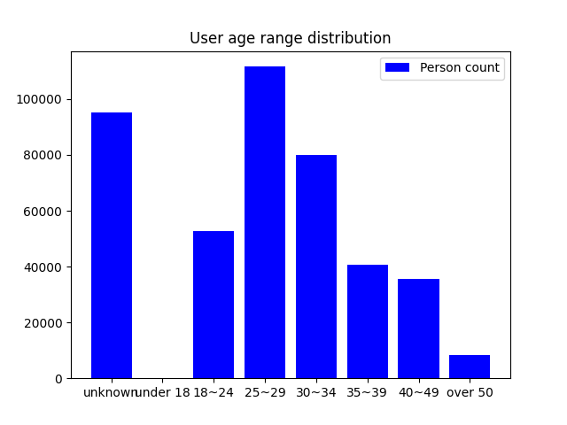
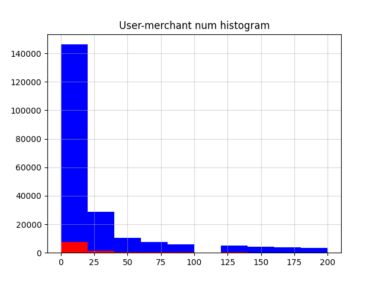

# 数据挖掘 最终实验报告

天猫复购概率预测挑战赛

- 计 92 黄植滇
- 计 92 钱厚德
- 计 92 项盛业

## 项目概况

本次实验使用 Python 语言，主要使用的第三方包括：

- 数据读取和处理：Pandas、Numpy
- 数据可视化：Matplotlib、Seaborn
- 数据挖掘算法与模型：Sklearn、LightGBM、Xgboost

具体使用的第三方版本详见仓库 `requirements.txt` 文件。仓库地址为：https://github.com/Ashitemaru/DM-Tmall-prediction。

本项目在官方测试集上 ROC 分数达到 0.679754，具体排行榜截图见下方部分。

## 数据预处理工作

考虑到本次派发的两个版本的数据中 `data_format1` 具有更为清晰的特征分类，故我们仅使用该版本数据进行预处理和后续的特征工程。

在读取用户画像、用户记录以及训练集、测试集后，我们作出如下的预处理：

- 将用户画像中 `age_range` 和 `gender` 字段中的 NaN 作填充，填充为表示未知的非空值
- 将用户记录中 `brand_id` 字段中 NaN 作填充，填充为零值
- 将用户记录中 `time_stamp` 字段拆分为月份、日期、星期数三列
- 将训练集的 `label` 字段合并到用户记录中，方便进行特征工程

本实验划分训练集和验证集的比例为，验证集占 20%，即 4 比 1 划分。

在本项目中，所有的特征数据分为三类，即用户特征、商家特征和用户-商家联合特征。这些特征的分类的和处理方式主要见特征工程部分。

最后，考虑到预处理比较消耗时间，我们做了持久化存储以提升多次运行的性能，具体使用方式见接下来的部分。

## 数据预处理可视化

我们可以对预处理过后的数据进行一些初步的统计分析：

### 用户特征

`user_info_format1.csv` 中给出了用户的性别、年龄信息：

用户信息中将用户年龄分为了八组，对应未知以及七组确定的年龄段，做出柱状图如下：



可以看出，除去 Unknown 对应的年龄未知组，用户数目最多的年龄分段为 25 - 29 岁。

同样，做出用户性别的柱状图如下：


可以看出，除去 Unknown 对应的年龄未知组，女性用户数目远多于男性用户数目。

联合用户性别、年龄特征做出柱状图：


从图中可以看出，在忽略年龄、性别未知的情况下，用户主体为年龄段在 18 - 34 岁的女性。

### 日志特征

`user_info_format1.csv` 中给出了用户行为日志，每条日志提供了操作用户的 ID，商家 ID，商品 ID，商品品类 ID，商品品牌 ID，购买时间，行为类型（包括点击、添加购物车、购买、添加收藏夹四种）。

从背景中得知，这些日志数据收集于“双十一”前半年与“双十一”当天，针对日志时间，做出直方图如下：


可以看出，10 月 - 11 月分箱中日志数据最多，对应实际中“双十一”活动期间，用户的操作最多。

针对日志的四种行为类型，做出柱状图如下：


从图中可以看出，绝大多数的日志对应的操作均为点击浏览。其次为购买和收藏，二者对应日志的数目大致相当。加入购物车的日志最少。

以上数据的初步可视化仅对应较为直接的信息，而在后面特征工程中对特征进行进一步计算与提取之后，将针对用户-商家的特征做进一步的可视化操作。

## 特征工程

本次实验中我们提取的特征分为三类，即用户特征、商家特征和用户-商家联合特征。

首先，该三类特征中都具有的字段包括下述，具体的特征表中 `u` 开头的表示用户的该特征，`m` 开头的表示商家的该特征，`um` 开头的表示用户-商家联合特征：

- `item_num`。表示与该物品交互的次数，整数类型
- `brand_num`。表示与该品牌交互的次数，整数类型
- `cat_num`。表示交互包含的商品种类数量，整数类型
- `cart_num`。表示该用户将商品加入购物车的次数 / 该商家商品被加入购物车的次数 / 该用户将该商家的商品加入购物车的次数，整数类型
- `click_num`。表示点击次数，意义同上述，整数类型
- `purchase_num`。表示购买次数，意义同上述，整数类型
- `favorite_num`。表示加入收藏夹次数，意义同上述，整数类型
- `pc_rate`。表示购买 / 单击比，意义同上述，浮点数类型
- `last_date`。表示最近活动日期，整数类型
- `dis_date`。表示最近和最早活动日期间隔时长，整数类型。

其他的用户特征主要是用户画像数据，包含下述字段：

- `age_range`。表示年龄范围，整数类型
- `gender`。表示性别，整数类型
- `log_num_x`。表示该用户的记录总数，整数类型
- `merchant_num`。表示和该用户交互过的商家总数，整数类型

其他的商家特征包括：

- `log_num_y`。表示该商家的记录总数，整数类型
- `user_num`。表示和该商家交互过的用户总数，整数类型
- `dup_user`。表示该商家的重复买家总数，整数类型

联合特征没有其他字段。

### 特征可视化

由于我们最终的结果会将一组用户-商家的对应关系作单位进行特征分析与聚类，接下来主要针对用户-商家联合特征进行可视化。

+ 用户-商家日志数直方图


从图中可以看出，对于某用户在某商家的行为日志数，图像表现出从 1 - 100 左高右低，即大多数的用户在某个商家只有 10 条以内的行为日志。

+ 用户-商家行为类型直方图

绘制出某用户在某商家的四种行为类型的计数，其中红色部分表示某用户是某商家的复购用户时，在该商家的四种行为类型的计数：

（1）点击操作：


（2）加入购物车操作：


（3）购买操作：


（4）收藏操作：


可以观察到这四个图像都表现出随着横坐标增大，纵坐标值近似反比例迅速缩减的趋势。这说明各类行为大多都是用户和商家一对一的，最多是一对二。同样，由于红色部分占有的图像面积相对是很小的，这也说明复购比例总体而言是很低的。

这两个结论相符合，即大多数的点击、购买、加入收藏夹、加入购物车行为基本都是用户和商家一对一的。即复购比例不应过大。

+ 用户-商家购买 / 点击比直方图

  

该图像呈现出三个较为集中的分布，即靠近零点、中点、一点。这说明用户的行为往往呈现出三种模式，分别为随意浏览商品而不购买、在浏览的若干商品中进行比对后购买较好的一半、有目的性地点击到指定商品并直接购买。而这三个行为模式也符合一般人的网购行为模式。

+ 用户-商家最早 / 最后操作间隔直方图

  

本图像也是近似反比例函数模式衰减，也就是说最早 / 最后操作基本上相对贴近，这表明了该数据集的行为日期较为集中，这一点会影响到后续各个模型的表现，后面会有详细的说明。

+ 相关度热力图


我们可以注意两个较为大的特征相关区，这两个区域分别对应了用户特征内部之间具有较大的关联度以及商家特征内部之间具有较大的关联度。

另外我们需要关注较为零散的高关联度特征对。可以注意到 `upc_rate` 和 `umpc_rate` 之间具有极大的关联度，这也说明了各种点击 / 购买比都具有较高关联度。

## 数据挖掘模型和算法

本项目使用了如下模型和算法：

- Logistic 模型

Logistic 模型即线性回归模型，是一种简单的分类器，使用 Sigmoid 函数激活，使用最大似然估计得到分类概率，拟合方法为梯度下降。这类模型运行速度较快，但是在本实验中表现一般。

- 多层感知机 MLP

MLP 采用了层与层之间的全连接简单神经网络，可以调整的参数包括激活函数、求解器、学习率调节器、隐含层大小等等，但是其训练速度较慢，在本实验中也表现一般。

- 决策树

决策树通过信息熵计算信息增益，可以调整的参数包括树的最大深度。限定最大深度可以防止深度过大的时候出现过拟合。

- 随机森林

随机森林算法基于决策树算法，我们可以同时建立多个决策树对随机抽取的数据进行分类，最后取这些树的均值作为最终预测结果，本质上是使用决策树进行求解的 Bagging 算法。

- 梯度提升树

与随机森林算法类似，梯度提升树同样基于决策树，但采用了 AdaBoost 算法来综合结果，对于不同的误差损失函数和迭代方法，提升树也可以细分出多种算法，梯度提升树采用均方误差和负梯度拟合残差的方法来进行计算，在此分类问题中效果不错。

- XGBoost

XGBoost 是优化的提升树，是现在最常用的几种分类算法之一，优点在于训练速度较快，准确率也略高于普通的梯度提升树。

- LGBM

LightGBM 同样是优化的梯度提升树算法，对于大规模的数据效果较好。对于这次分类问题，LGBM 取得了最优的最终结果。

上述各个算法和模型，在我们手动划分的验证集上得到的 Accuracy 和 ROC-AUC 评分表现为下表：

|            | ACC      | ROC-AUC  |
| ---------- | -------- | -------- |
| Logistic   | 0.939317 | 0.632777 |
| MLP        | 0.939221 | 0.500000 |
| 决策树     | 0.939241 | 0.636581 |
| 随机森林   | 0.938608 | 0.599090 |
| 梯度提升树 | 0.939183 | 0.694382 |
| XGBoost    | 0.939240 | 0.695407 |
| LGBM       | 0.939202 | 0.699082 |

## 模型选择

这里在经过多次实验之后，在验证集上均得到与下述类似的实验结果：

```text
ACC score for model Logistic: 0.9393172713855826
ROC-AUC score for model Logistic: 0.6327768318568792
ACC score for model MLP: 0.9392214363751366
ROC-AUC score for model MLP: 0.5
ACC score for model Decision-tree: 0.9392406033772258
ROC-AUC score for model Decision-tree: 0.6365814981648905
ACC score for model Random-forest: 0.938608092308282
ROC-AUC score for model Random-forest: 0.5990898838292975
ACC score for model Grad-tree: 0.9391831023709581
ROC-AUC score for model Grad-tree: 0.6943816933631374
ACC score for model Xgboost: 0.9392406033772258
ROC-AUC score for model Xgboost: 0.6954071536597484
ACC score for model LGBM: 0.9392022693730474
ROC-AUC score for model LGBM: 0.6990823937837837
```

这表明在本工程中 LGBM 往往能够得到最佳的结果，故最后我们选择 LGBM 作为最后测试集标签生成模型，也用于下述特征评估实验。

### 模型选择具体分析

这里我们可以发现 Logistic、MLP 模型的表现并不优秀。

Logistic 模型运算原理过于简单，贴合线性分类器。在部分条件下甚至会表现很差（见下面的分析）。

MLP 由于全连接，并不能很好做到特征分类，而是每次都把所有特征考虑在内，不能很好利用我们作出的特征工程。实验也说明 MLP 的效果并不佳。

剩余若干的模型原理均类似，最后我们根据实验结果选择了表现最好的 LGBM 作为最后的实验模型。

## 特征选择

在上述设置的条件下，我们会在实验中删去部分特征并求取最后的 LGBM 模型评分，据此分析各个特征对最后结果的影响，上述结果报告如下。

### 用户画像特征

用户画像特征这里特指 `age_range` 和 `gender` 两个字段，我们将这两个特征删除后得到下述实验结果（仅报告 ROC-AUC 评分，下述分析同）：

```text
ROC-AUC score for model Logistic: 0.621749746732174
ROC-AUC score for model MLP: 0.5000510172846561
ROC-AUC score for model Decision-tree: 0.6365814981648905
ROC-AUC score for model Random-forest: 0.5900060132802016
ROC-AUC score for model Grad-tree: 0.6934003396817718
ROC-AUC score for model Xgboost: 0.6955380411590071
ROC-AUC score for model LGBM: 0.6998834359655184
```

可以看出各个模型的评分均有下降，但是下降幅度并不明显。这说明在本次特征工程中对年龄和性别的提取运用并不全面。

我们在该结果的基础上，尝试过将年龄和性别作出拆分处理。因为这两个特征，尤其是 `gender` 是枚举量，并不能作四则运算，或者其四则运算的定义和意义并不明确。这一部分详见代码 `src/feature.py` 中 `# SPLIT START` 注释处的处理。但是在经过拆分后，我们注意到 ROC-AUC 评分依然和原先相比甚至有所下降，该问题的原因我们暂且没有得到结论。

### 记录总数

我们删除 `log_num` 特征之后，得到的结果为：

```text
ROC-AUC score for model Logistic: 0.6269916005271292
ROC-AUC score for model MLP: 0.4999897965430688
ROC-AUC score for model Decision-tree: 0.6365814981648905
ROC-AUC score for model Random-forest: 0.5923092264163831
ROC-AUC score for model Grad-tree: 0.6942311006388524
ROC-AUC score for model Xgboost: 0.6955441632331658
ROC-AUC score for model LGBM: 0.6999477531505024
```

和用户画像特征类似，该特征删除后评分均有所下降，但是幅度不大。也就是说记录总数特征对结果有积极作用，但是作用并不明显。

### 交互物品 / 品牌 / 种类数目

删除 `item_num / brand_num / cat_num` 特征后，得到的结果为：

```text
ROC-AUC score for model Logistic: 0.6212986058730325
ROC-AUC score for model MLP: 0.4998591697630565
ROC-AUC score for model Decision-tree: 0.6502103457130771
ROC-AUC score for model Random-forest: 0.59033931869619
ROC-AUC score for model Grad-tree: 0.693038815430794
ROC-AUC score for model Xgboost: 0.6933833671806999
ROC-AUC score for model LGBM: 0.6972831670448811
```

可见删除特征后评分有所下降，但依然幅度不大。也就是说这些特征对结果有积极作用，但是作用依然不明显。

### 点击 / 购买 / 加入购物车 / 加入收藏夹次数

删除 `click_num / purchase_num / cart_num / favorite_num` 特征后（单击购买比特征也随之失效），得到的结果为：

```text
ROC-AUC score for model Logistic: 0.6188548360941784
ROC-AUC score for model MLP: 0.49947401662333035
ROC-AUC score for model Decision-tree: 0.6343135593771346
ROC-AUC score for model Random-forest: 0.5888305621667018
ROC-AUC score for model Grad-tree: 0.6842318673465624
ROC-AUC score for model Xgboost: 0.6829595220172897
ROC-AUC score for model LGBM: 0.6874067035488911
```

可以注意到评分下降幅度较大，所以表示用户、商家行为的数据对于分析复购概率有着较为明显的效果。

### 日期相关特征

删除所有和日期相关的特征后，得到的结果为：

```text
ROC-AUC score for model Logistic: 0.5129412665200244
ROC-AUC score for model MLP: 0.5
ROC-AUC score for model Decision-tree: 0.6390037795278226
ROC-AUC score for model Random-forest: 0.5898863206147619
ROC-AUC score for model Grad-tree: 0.6917831207269804
ROC-AUC score for model Xgboost: 0.6929901478381127
ROC-AUC score for model LGBM: 0.698430505542344
```

可以注意到评分并没有明显的下降，但是 Logistic 模型的评分严重下降。这说明了该数据具有积极作用，但是作用并不明显。

我们认为日期数据的分布对 Logistic 模型是相当重要的。因为天猫商城的数据中 618、双十一、双十二等日期的数据明显较为突出，且更能描述用户行为特征。通过分析这些时段的特征表现对 Logistic 模型较为重要，即通过加入日期特征，让这些时段的数据具有较为高的权重，更有可能让原理简单、近似于线性分类器的 Logistic 模型得到贴合实际的结果。

## 最终测试集结果

我们最终采用了上述的全部特征，并使用 LGBM 作为训练模型。在该条件下，验证集上的 ROC-AUC 得分接近 0.7，在测试集上的 ROC-AUC 得分为 0.679754（下述排行榜上的 ouoqwq），接近 0.68：


## 代码文档和运行方式

运行本次代码首先需要在根目录下使用下述命令安装第三方：

```shell
pip install -r requirements.txt
```

之后调整 `src/config.py` 文件设定需要的运行方式，Config 字段包括：

- `mode`。可以选择 `train` 和 `analysis`，前者表示完整的预处理、特征提取、模型拟合流程，后者会在进行完毕特征提取后直接进行数据可视化

- 各类 `path`。数据集的存放位置
- `debug`。布尔值，表示是否输出 Debug 信息
- `use_cache`。布尔值，表示是否使用缓存的用户记录，如果置真，则必须保证 `user_log_cache_path` 指向的位置有合法的预处理完毕的用户记录信息
- `chosen_model`。最终选择用于生成测试集标签的模型
- `model_types`。用于训练的模型列表

在上述设置完毕后，使用下述命令运行本项目：

```shell
python ./src/main.py
```

如果选择了 `train` 模式，则可以在 `./data` 目录下找到需要提交的 `.csv` 文件。

---

本项目的代码的处理流程大约为：

- 数据预处理，包括读入数据，并且按照上述流程进行数据预处理。如果没有使用持久化，则会将用户记录写入文件。逻辑位于 `preprocess.py` 文件
- 特征工程，即将用户记录和用户画像合并到训练集之中。逻辑位于 `feature.py`
- 模型训练，接受特征工程后的数据，根据从 `model.py` 中获取到的模型，根据数据调节模型的参数，最终返回训练后的模型，最后根据选定的模型最终得到结果

如果选择了分析模式，那么分析和数据可视化的代码位于 `analysis.py` 文件。

## 队内分工

- 黄植滇 - 部分特征工程、数据预处理分析和可视化
- 钱厚德 - 部分特征工程、代码框架、数据持久化、实验报告
- 项盛业 - 特征工程、模型选型、模型训练、调试


